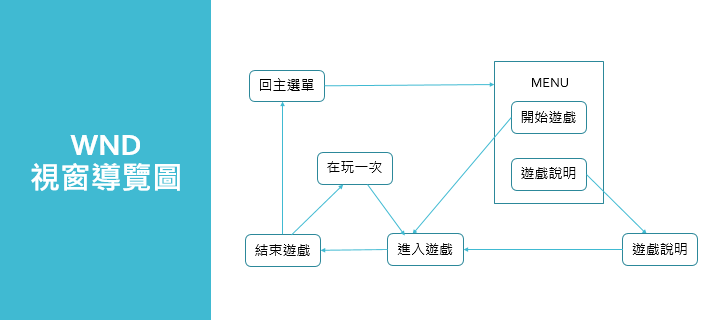

# 主題：VR-滑翔翼
# 組別:6
# 組員：0424015 朱凱菱  (0424076 林奕全  0424080 曾茜筠)他們倆個在B班
# 指導老師：黃文楨

## 專案介紹：在虛擬環境中用體感裝置控制飛行的方向，通過空中出現的圓環便可加分累積分數，通過越多分數越高，碰到障礙物則結束遊戲。
## 專題效益：讓忙碌的現代人在家裡玩遊戲也能動一動身體，有助於身心靈的健康，也能讓年老者活化腦細胞，減緩衰老，是一個老少咸宜的遊戲。
## 初步做法：利用Unity建立進入遊戲主選單及遊戲場景，加入體感設備偵測手部角度，控制飛行方向，設計圓環並撰寫累積分數程式。
## 功能性:
## 1.遊戲開始的介面採第一人稱視角
## 2.偵測兩隻搖桿的相對高度，判斷向左或向右

